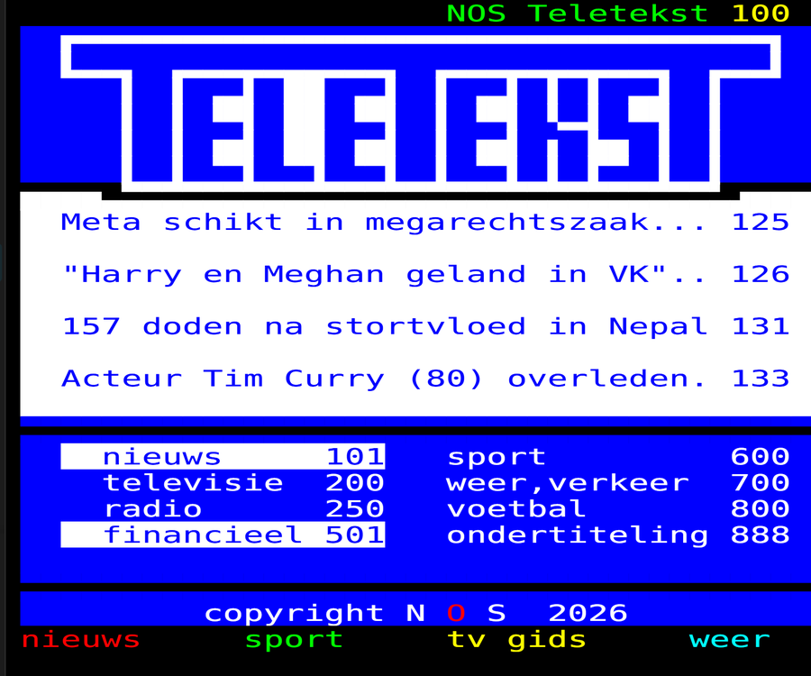
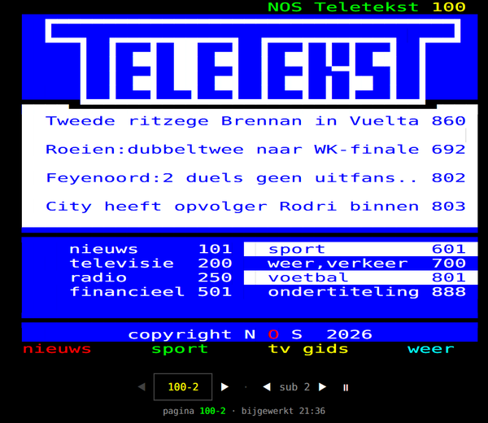
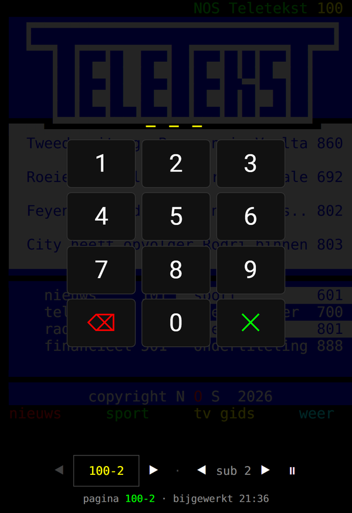

<h1 align="center">NOS Teletekst voor Home Assistant</h1>

<p align="center">
  Teletekst zoals het op tv staat: 40&times;24 tekens, blokgrafiek en de acht
  teletekstkleuren.<br>
  En omdat het gewone entiteiten zijn, kun je er ook mee automatiseren.
</p>

<p align="center">
  <a href="https://hacs.xyz/docs/faq/custom_repositories"></a>
  <a href="https://github.com/schakelkast/teletekst-101/releases"></a>
  <a href="https://github.com/schakelkast/teletekst-101/actions/workflows/validate.yml"></a>
  <a href="LICENSE"></a>
</p>

<p align="center">
  
</p>

<p align="center">
  <sub><b>English</b> &mdash; Dutch NOS Teletext inside Home Assistant: two Lovelace
  cards, a sensor per page with the plain text, keyword alerts, live traffic
  information from the ANWB pages, and a rendered image entity you can use in
  notifications or on an e-ink display. Interface and documentation are in Dutch,
  as is the source.</sub>
</p>

## In het kort

| | |
|---|---|
| **Kaarten** | de pagina zoals hij uitgezonden wordt, en een leesbare koppenlijst |
| **Per pagina** | een sensor met de tekst, en een afbeelding van de pagina |
| **Trefwoorden** | een sensor die aangaat bij nieuws over jouw onderwerp |
| **Verkeer** | files en afsluitingen per weg, uit de ANWB-pagina's |
| **Diensten** | elke pagina ophalen of doorzoeken vanuit een automatisering |
| **Eigen sensoren** | wijs zelf een regel van een pagina aan en maak er een sensor van |
| **Instellen** | volledig via de interface, geen YAML nodig |
| **Standaard leeg** | installeren maakt niets aan; jij kiest wat je wilt |

## Wat je ermee kunt

**Een melding als er nieuws is over jouw onderwerp.** Geef trefwoorden op — je
club, je woonplaats, een dossier dat je volgt — en er komt een sensor per woord
die aangaat zodra het op een gevolgde pagina verschijnt.

```yaml
triggers:
  - trigger: state
    entity_id: binary_sensor.nos_teletekst_trefwoord_feyenoord
    to: "on"
actions:
  - action: notify.mobile_app_telefoon
    data:
      title: Teletekst
      message: "{{ state_attr(trigger.entity_id, 'regels') | join(' — ') }}"
```

**Het nieuws voorlezen bij je ochtendroutine.** De volledige pagina staat als
platte tekst klaar, zonder blokgrafiek, dus een spraakassistent maakt er geen
onzin van.

```yaml
actions:
  - action: tts.speak
    target:
      entity_id: tts.google
    data:
      media_player_entity_id: media_player.keuken
      message: >-
        Goedemorgen. Het nieuws van teletekst:
        {{ state_attr('sensor.nos_teletekst_pagina_101', 'tekst') }}
```

**Weten of het vastloopt op jouw route.** Zet verkeersinformatie aan en geef de
wegen op die je rijdt. Elke weg krijgt een sensor die aangaat zodra er een
melding voor staat, met de vertraging erbij — uitgelezen uit de ANWB-pagina's.

```yaml
triggers:
  - trigger: time
    at: "07:15:00"
conditions:
  - condition: state
    entity_id: binary_sensor.nos_teletekst_verkeer_a15
    state: "on"
actions:
  - action: notify.mobile_app_telefoon
    data:
      title: "File op de A15"
      message: >-
        {{ state_attr('binary_sensor.nos_teletekst_verkeer_a15', 'km') }} km,
        {{ state_attr('binary_sensor.nos_teletekst_verkeer_a15', 'minuten') }} minuten vertraging.
```

Er is ook een `sensor.nos_teletekst_verkeer` met het totale aantal files, de
opgetelde kilometers en alle meldingen in de attributen.

**Een koppenlijst op je dashboard.** Elke kop komt met het paginanummer waar
het bericht staat, dus je kunt er doorheen klikken.

```jinja

- {{ k.tekst }} ({{ k.pagina }})

```

**Teletekst laten voorlezen door Assist.** Vraag het gewoon; er is geen extra
instelling voor nodig.

```yaml
triggers:
  - trigger: conversation
    command:
      - "wat staat er op teletekst"
      - "lees het nieuws voor"
actions:
  - action: nos_teletekst.pagina_ophalen
    data:
      pagina: "101"
    response_variable: pagina
  - set_conversation_response: "{{ pagina.kop }}"
```

**Teletekst als plaatje, ook buiten je dashboard.** Elke gevolgde pagina krijgt
een `image`-entiteit die de pagina tekent zoals hij op tv staat — met kleuren en
blokgrafiek. Meesturen in een melding, op een e-ink schermpje zetten, of in een
gewone plaatjeskaart tonen.

```yaml
actions:
  - action: notify.mobile_app_telefoon
    data:
      message: "Het nieuws van teletekst"
      data:
        image: /api/image_proxy/image.nos_teletekst_pagina_101_beeld
```

**Vanuit een ander systeem.** Node-RED, een script of wat dan ook kan de pagina
rechtstreeks ophalen bij Home Assistant, met een gewoon toegangstoken:

```bash
curl -H "Authorization: Bearer <token>"      http://homeassistant.local:8123/api/nos_teletekst/101
```

Je krijgt de ruwe teletekst-HTML terug plus `tekst`, `regels`, `koppen` en
`koppen_markdown`.

**En gewoon: teletekst kijken.** Op je telefoon, je tablet of een wandpaneel.
Subpagina's lopen vanzelf door, net als op tv.

<p>
  
  
</p>

## Installatie

**Via HACS** — open HACS, kies rechtsboven *Custom repositories*, plak
`https://github.com/schakelkast/teletekst-101` en kies type *Integration*.
Installeer daarna *NOS Teletekst* en herstart Home Assistant. Ga vervolgens naar
**Instellingen → Apparaten en diensten → Integratie toevoegen** en kies
*NOS Teletekst*.

**Handmatig** — kopieer `custom_components/nos_teletekst` naar je
`config/custom_components/`, herstart, en voeg de integratie toe.

Er hoeft niets in `configuration.yaml` en er hoeft geen Lovelace-resource
toegevoegd te worden: de integratie regelt dat zelf.

## De kaarten

Beide kaarten hebben een gewoon instellingsscherm: je hoeft geen YAML te
schrijven. Kies ze in de kaartkiezer en vul de velden in.

Er zijn er twee. **NOS Teletekst** geeft de pagina zoals hij uitgezonden wordt.
**NOS Teletekst koppen** geeft dezelfde inhoud als leeslijst — prettiger op een
telefoon:

```yaml
type: custom:nos-teletekst-koppen-card
entity: sensor.nos_teletekst_pagina_101
```

Tik je op een kop, dan wordt dat bericht opgehaald en uitgeklapt. De lijst komt
uit het `koppen`-attribuut van de sensor, dus kies een overzichtspagina zoals
101 of 601.

### De teletekstkaart

Voeg de kaart **NOS Teletekst** toe aan een dashboard, of met de hand:

```yaml
type: custom:nos-teletekst-card
page: "101"
favorieten:
  - naam: Nieuws
    pagina: "101"
  - naam: Sport
    pagina: "601"
  - naam: Weer
    pagina: "702"
  - naam: Verkeer
    pagina: "730"
```

| optie | standaard | betekenis |
|---|---|---|
| `page` | `"100"` | beginpagina, subpagina mag ook: `100-2` |
| `refresh` | `60` | seconden tussen automatisch verversen, `0` zet het uit |
| `controls` | `true` | knoppenbalk onder of naast de pagina |
| `favorieten` | `[]` | snelknoppen, elk met `naam` en `pagina` |
| `subpages` | `"auto"` | subpagina's vanzelf doorlopen, `"off"` zet het uit |
| `subpage_seconds` | `8` | hoe lang een subpagina blijft staan |
| `aspect` | `"auto"` | `web` = smal zoals nos.nl, `tv` = breed zoals 4:3 |
| `max_height` | `0` | vaste maximumhoogte in pixels, `0` = zelf de ruimte meten |

### Bedienen

- **vegen** links/rechts is vorige/volgende pagina, omhoog/omlaag is subpagina
- **tikken** op een paginanummer in de tekst, of op de gekleurde regel onderaan
- **cijferblok** verschijnt als je het paginaveld aanraakt: drie cijfers en hij
  springt, net als met de afstandsbediening
- **toetsenbord**: cijfers intikken, pijltjestoetsen bladeren, Esc sluit

Blader je zelf door de subpagina's, dan stopt het automatisch doorlopen — je
bent dan aan het lezen, en dan is het vervelend als het beeld wegspringt. Met de
pauzeknop zet je het weer aan.

## Entiteiten, diensten en gebeurtenissen

Bij **Configureren** kies je welke pagina's je volgt, hoe vaak ze ververst
worden en op welke trefwoorden gelet wordt.

### Sensoren

Elke gevolgde pagina krijgt een sensor. De toestand is de eerste betekenisvolle
regel; de rest staat in de attributen:

| attribuut | inhoud |
|---|---|
| `tekst` | de hele pagina als platte tekst |
| `regels` | dezelfde tekst als lijst |
| `koppen` | koppen met het paginanummer erbij: `[{tekst, pagina}]` |
| `koppen_markdown` | dezelfde koppen als lijst, zo in een Markdown-kaart te plakken |
| `verwijzingen` | alle paginanummers waar deze pagina naar doorverwijst |
| `volgende_pagina`, `volgende_subpagina` | om doorheen te bladeren |

Elk trefwoord krijgt een `binary_sensor` die aangaat zodra het woord op een van
je gevolgde pagina's staat, met de gevonden regels in de attributen.

### Afbeelding

Elke gevolgde pagina krijgt ook een `image`-entiteit: de pagina getekend met het
echte teletekstfont, in 4:3 zoals op tv. Bruikbaar in een plaatjeskaart, in een
melding, of op een e-ink display.

### Snel instellen

Na het installeren staat er niets in je lijst. Dat is met opzet: teletekst
kijken kan zonder entiteiten, en niemand wil een lijst die zichzelf volgooit.

Wil je wel iets, dan gaat dat via **Configureren → Snel instellen**. Kies wat je
wilt en de rest wordt goed gezet:

| Keuze | Wat je krijgt |
|---|---|
| Het nieuws volgen | pagina 101 met de tekst erin |
| Seintje bij nieuws over mijn club | een sensor die aangaat bij jouw woord, op nieuws en sport |
| Afbeelding van een pagina | de pagina getekend, voor e-ink of een melding |
| Files op mijn route | verkeersinformatie, met een sensor per weg die je opgeeft |
| Temperatuur bij mij in de buurt | het getal achter jouw plaatsnaam op de weerpagina |

Wat je al had ingesteld blijft daarbij staan.

### Zelf een sensor maken

Teletekst staat vol met dingen waar precies één iemand op zit te wachten: de
temperatuur in De Bilt, een waterstand, de stand van je club. Bij
**Configureren → Eigen sensor maken** wijs je zelf aan wat je wilt volgen.

Je kiest een pagina en hoe de regel gevonden moet worden:

- **de eerste regel met een woord erin** — bijvoorbeeld `De Bilt` op pagina 702
- **een vast regelnummer** — regel 1 is de bovenste rij van de pagina

Daarna kun je aanvinken dat je alleen het eerste getal van die regel wilt, met
een eenheid erbij. Dan krijg je een gewone getalsensor waar je grafieken van kunt
maken. De pagina hoeft er niet een te zijn die je al volgt; hij wordt vanzelf
opgehaald.

Het attribuut `gevonden_regel` laat zien welke regel gepakt is, zodat je kunt
zien of je goed hebt gemikt.

### Wat er aangemaakt wordt

Per gevolgde pagina kun je aanvinken wat je wilt: de tekstsensor, de afbeelding,
of allebei. De afbeelding staat standaard uit. Wat je uitvinkt verdwijnt uit je
lijst — er blijven geen dode entiteiten achter.

### Verkeer

Zet je verkeersinformatie aan, dan wordt pagina 730 met al zijn subpagina's
uitgelezen tot losse meldingen. Je krijgt `sensor.nos_teletekst_verkeer` met het
aantal files als toestand, en in de attributen `totaal_km`, `totaal_minuten`,
`wegen` en `meldingen`. Elke melding is opgesplitst:

```yaml
soort: Files            # of Afsluiting/Omleiding
weg: A12
van: Duitse grens
naar: Arnhem
km: 3
minuten: 2
tekst: "A12 Duitse grens->Arnhem tussen knp. Oud-Dijk en Duiven 3 km,2 min., ..."
```

Geef je wegen op, dan krijgt elke weg een eigen `binary_sensor` met alleen de
meldingen voor die weg. Bron is de ANWB, via de NOS.

### Gebeurtenis

`nos_teletekst_pagina_gewijzigd` komt langs zodra een gevolgde pagina
inhoudelijk verandert, met `pagina`, `kop` en `tekst`.

### Diensten

**`nos_teletekst.pagina_ophalen`** haalt elke pagina op, ook eentje die je niet
volgt, en geeft hem terug als tekst, regels en koppen.

**`nos_teletekst.zoeken`** zoekt een woord in de pagina's die je opgeeft. Elke
pagina is een aparte aanvraag bij de NOS, dus er worden er maximaal 30 tegelijk
doorzocht.

## Hoe het werkt

De pagina's komen van `teletekst-data.nos.nl`, dezelfde bron als
nos.nl/teletekst. Die API stuurt geen CORS-headers, dus de browser mag hem niet
rechtstreeks aanroepen. De integratie haalt de pagina daarom op vanaf Home
Assistant zelf en biedt hem aan op `/api/nos_teletekst/<pagina>`, achter je
gewone login.

De blokgrafiek zit in het teletekstfont van de NOS (Android VeraMono), dat
meegeleverd wordt en lokaal geserveerd — geen verbinding met een CDN. Bij het
omzetten naar platte tekst worden die tekens (F020–F07F) vervangen door spaties:
het zijn tekeningen, geen letters.

Een teken-cel is op nos.nl 0,602 × 1,204 em, dus smal en hoog. Op tv staat
teletekst op een 4:3-beeld en zijn de tekens duidelijk breder. De kaart meet de
beschikbare ruimte, kiest daarbinnen de verhouding en rekt de tekst horizontaal
op — smal op een telefoon, breed op een groot scherm, en nooit breder dan tv.

## Niet van de NOS

Dit project is **niet van de NOS en heeft geen band met de NOS** — niet
aangesloten, niet goedgekeurd, niet gesponsord. De naam wordt alleen gebruikt om
te beschrijven welke dienst deze integratie ontsluit. De pagina's en het
lettertype komen van de NOS en blijven van hen; zie [MERK.md](MERK.md).

## Dank

Aan de NOS, die teletekst al sinds 1980 uitzendt en de pagina's ook als JSON
beschikbaar stelt.

## Meehelpen, forken en hergebruiken

Verbeteringen zijn welkom — er valt nog genoeg te doen: een echte
ondertitelingsmodus, beursinformatie uitlezen, of gewoon een scherper oog voor
waar het beeld nog afwijkt van de uitzending. Zie
[CONTRIBUTING.md](CONTRIBUTING.md).

Er staan tests bij (`python -m pytest tests -q`), zodat je kunt zien of je
wijziging iets breekt voordat je hem instuurt.

**Klonen en zelf verder bouwen mag, graag zelfs.** De code staat onder de
[MIT-licentie](LICENSE): je mag hem kopiëren, aanpassen, verspreiden en er zelfs
iets mee verdienen. Daar staat één voorwaarde tegenover, en die is niet
vrijblijvend — de licentie verplicht het:

> Houd het bestand `LICENSE` met de copyrightvermelding in je kopie.

**Neem je ook het icoon mee, dan geldt er meer.** Logo's vallen niet onder MIT,
dus daar staan aparte afspraken voor in [MERK.md](MERK.md): noem de bron met een
link hierheen, wek niet de indruk dat jouw versie de originele is, en maak een
eigen icoon zodra je iets wezenlijk anders bouwt. Vervang je het icoon door eigen
werk, dan heb je alleen met MIT te maken.

Heb je iets werkends gemaakt? Stuur een pull request. Dan heeft iedereen er wat
aan in plaats van dat het in een losse fork blijft hangen.
